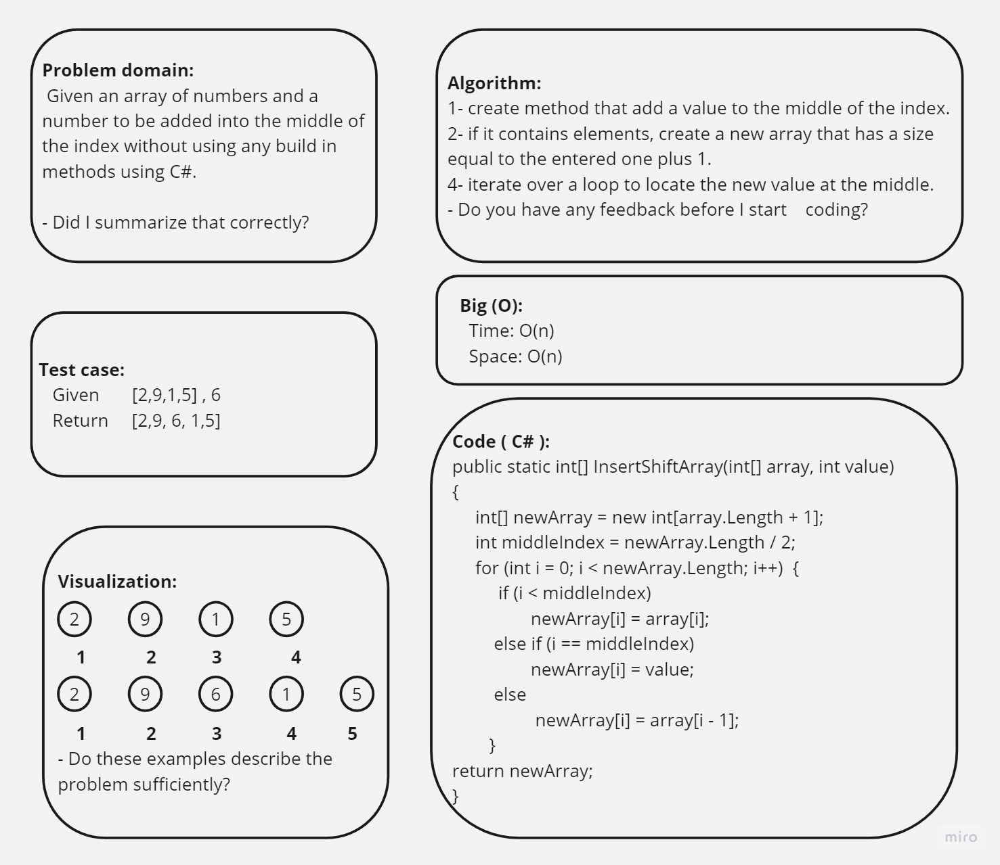

# Array Insert Shift
We are going to build a method that insert a number in the middle of the array index.

## Whiteboard Process

## Approach & Efficiency

The approach used in the code is to create a new array with the same length as the input array plus one. Then, using a loop, it iterates over the input array and assigns the elements to the new array as the original array, once it reach the middle index it will add new given value then continue fill other values. Finally, it returns new array and the given array located at the middle.

Efficiency:

Time Complexity: The code has a time complexity of O(N). This is because it iterates over the input array to create the reversed array.
Space Complexity: The code has a space complexity of O(N). It creates a new array with the same length plus one as the input array to store the original elements added with the new one at the middle.
## Solution
Create a new console application project, replace the default code in the Program.cs file with the corrected code from above, and run the project.
Once the code is running, you will see the output in the console.