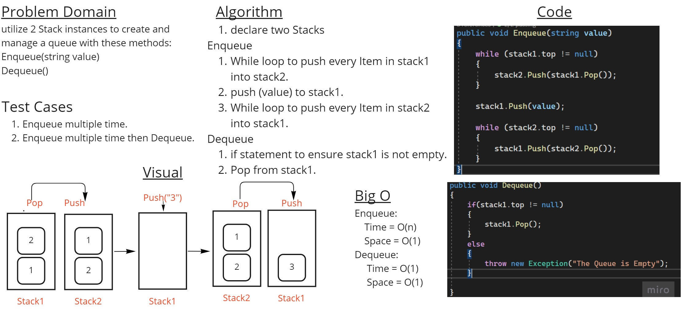

# Stack Queue Pseudo
## Summary
In this C# code challenge, the task is to create a new class called PseudoQueue without using an existing Queue implementation. The queue should be managed using two Stack instances. The required methods to be implemented are Enqueue and Dequeue.

## Whiteboard Process:

## Approach & Efficiency
The time complexity of the Enqueue method is O(n), while the time complexity of the Dequeue method is O(1).

## Solution
To enqueue or dequeue elements, follow these steps:
1- Create an object of the PseudoQueue class.

2- To enqueue an element, call the Enqueue method and provide the value to be enqueued.
To dequeue an element, call the Dequeue method.