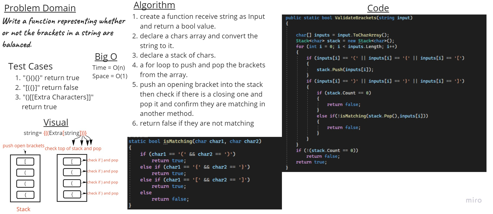

## Summary:

This project provides a C# implementation of a bracket validation method. The ValidateBrackets method checks whether a given string contains properly balanced brackets. Balanced brackets are pairs of opening and closing brackets, such as (), {}, or []. The method efficiently determines if the input string's brackets are balanced or not.

## Whitwboard

## Approach:

The ValidateBrackets method uses a stack data structure to validate the brackets in the input string. It iterates through each character in the input and performs the following steps:

If the character is an opening bracket (e.g., '(', '{', '['), it pushes it onto the stack.
If the character is a closing bracket (e.g., ')', '}', ']'), it checks if the stack is empty. If it is, the method returns false.

If the stack is not empty, it pops the top element from the stack and checks if it matches the current closing bracket using a helper method called isMatching. If they do not match, the method returns false.

After processing all characters, if the stack is not empty, it means there are unmatched opening brackets, and the method returns false. Otherwise, it returns true.

## Efficiency:

The ValidateBrackets method is efficient with a time complexity of O(n), where n is the length of the input string. It iterates through each character in the string once, and the stack operations are constant time.

The space complexity of the method is also O(n) in the worst case. However, in practice, the space complexity is typically smaller since closing brackets reduce the stack size.