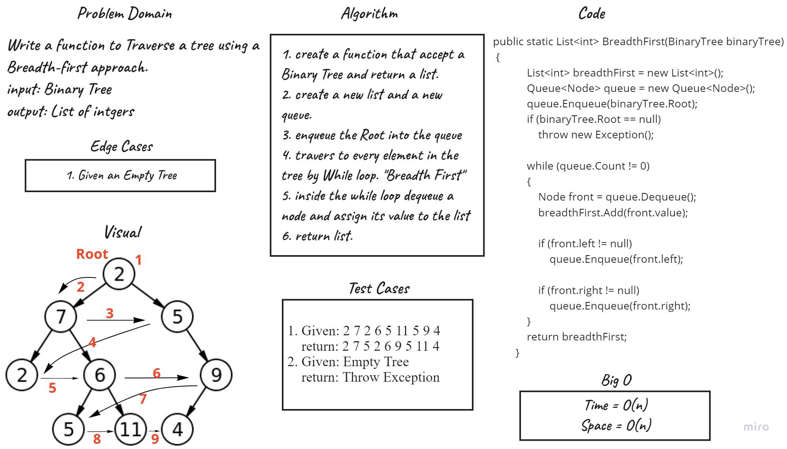

# Tree Breadth-First
Create a method that accepts three arguments and returns an array of integers. Initialize a list and a queue to store nodes. Add the root node to the queue and use a loop to iterate until the queue is empty. During each iteration, enqueue the left and right child nodes of the current node. In each run, add the first element added to the queue to the list. Finally, when the queue is empty, remove the data, and the new list will contain all data level by level.

## Whiteboard

## Approach & Efficiency
BreadthFirst function time complixity is O(n)